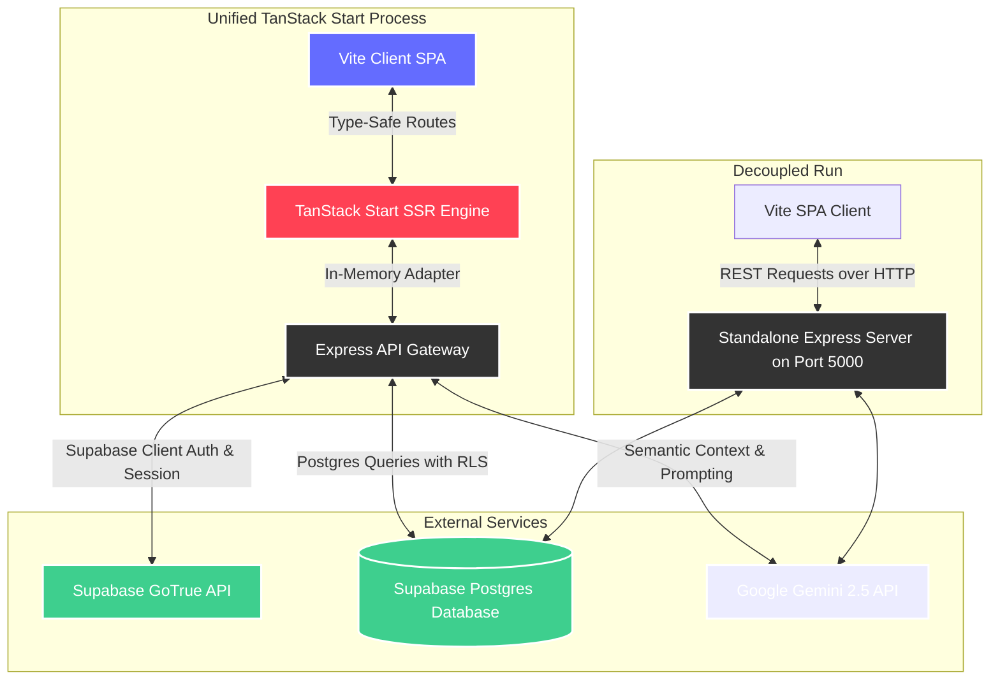

# 🌌 FlowPilot AI — Personal Life Operating System

<div align="center">

[](https://react.dev)
[](https://www.typescriptlang.org)
[](https://vite.dev)
[](https://tanstack.com/start)
[](https://tailwindcss.com)
[](https://supabase.com)
[](https://ai.google.dev)

**An adaptive, beautiful, and intelligence-driven life co-pilot that coordinates your tasks, habits, plans, and long-term goals into one elegant, glassmorphic dashboard.**

[Explore App](#-architecture-overview) • [Installation](#-installation--setup) • [Deployment](#-deployment-guide) • [Highlights](#-project-highlights)

</div>

---

## 📖 1. Overview & Value Proposition

In today’s fast-paced world, managing tasks, daily habits, calendar events, and long-term goals across multiple fragmented apps leads to cognitive overload and "productivity fatigue." Most planners are static, failing to adapt when life inevitably shifts.

**FlowPilot AI** solves this by introducing a **unified, adaptive Personal Life Operating System**. It acts as your personalized workspace co-pilot:

- **The Unified Timeline**: Coalesces tasks, habits, goals, focus timer blocks, and breaks into a single, cohesive schedule block.
- **The Adaptive AI Planner**: Driven by Google Gemini, the planner analyzes your constraints, active goals, and working hours settings to automatically draft, prune, and optimize your schedule day-to-day.
- **The High-Performance Workspace**: Immersive HSL tailored dark themes, smooth fluid micro-animations, glassmorphism layers, and zero-flash boots create a gorgeous visual experience that is a joy to interact with.

---

## ✨ 2. Implemented Features

- **🔐 Authentication & User Isolation**: Resilient signup, login, and token session persistence built on Supabase Auth. Complete tenant isolation secures user accounts using Supabase Row Level Security (RLS) policies.
- **📝 Smart Task Triage**: Create, edit, and organize tasks with dynamic tags, due dates, colors, and priority weightings (`low`, `med`, `high`). Breakdown complex tasks into structured subtasks with AI.
- **🌱 Habit Compliance**: Track daily habits with checklist completions. Streaks and consistency ratios are calculated automatically using historical logs over rolling 30-day windows.
- **🎯 Goal Progress Tracking**: Exposes Career, Learning, Health, and Personal category goals with AI roadmap milestone generation and automated progress calculation.
- **⏱️ Focus Session Logging**: Log deep focus intervals associated with tasks and goals. Includes focus session statistics tracking completion rates, monthly/weekly breakdown, and deep work streaks.
- **📅 AI Planner with Working Hours**: Set custom daily working boundaries (e.g. `10:00` to `16:00`), preferred focus durations, and break rules. Gemini generates complete plans fitting strictly within these slots.
- **🤖 AI Assistant Workspace Copilot**: Multiturn chat leveraging Gemini 2.5 Flash for proactive briefs, standup reviews, offline-ready fallback templates, and interactive chat confirmation cards to update or delete tasks safely.
- **📊 Analytics & Reviews**: KPI analytics reporting today's success score, AI life balance metrics, habit streaks, 14-day productivity trends, and comprehensive weekly/monthly retrospective reviews compiled with Gemini AI insights.
- **🔔 Proactive Notifications Triage**: Automated background scans alert you of backlog build-up, overdue tasks, or broken habits with color-coded low, medium, and high importance flags.
- **🔍 Global Command Palette**: Keyboard-triggered (`Ctrl+K` / `⌘+K`) global search modal. Instantly filters matched tasks, habits, and goals with priority ranking (exact match ➔ starts-with ➔ contains matches) or triggers Quick Navigation links.
- **📅 Synchronized Calendar**: Month-view calendar displaying scheduled tasks and habit completion ticks.
- **⚙️ Tunable Settings**: Live database sync for user timezones, profile names, working hours, and a real-time bidirectional Light/Dark theme toggler.

---

## 🛠️ 3. Tech Stack

### Frontend

- **Core Framework**: React 19, TypeScript 5, Vite 7
- **Meta-Framework & Routing**: TanStack Start v1 (`@tanstack/react-start`) for server-side rendering (SSR) and file-based type-safe route trees.
- **Caching & Queries**: TanStack Query (`@tanstack/react-query`) for local caching and server state updates.
- **Styling**: Tailwind CSS v4, Lucide React (for premium typography and icons).
- **Animation**: Framer Motion (for fluid, modern transitions and micro-interactions).

### Backend

- **Environment**: Node.js, Express, TypeScript.
- **In-Memory Express Adapter**: Express core gateway is mounted inside the TanStack Start app using an in-memory adapter ([expressAdapter.ts](file:///d:/flowpilot/src/lib/expressAdapter.ts)). This translates Web API Request/Response objects into mock Node.js HTTP objects, allowing the standard Express app to run serverless or within a unified single-process development environment.
- **Security & Logs**: Helmet (secure headers), Winston + Morgan (structured logging pipelines), express-rate-limit.

### Infrastructure & Services

- **Database & Auth**: Supabase (Postgres, GoTrue Auth)
- **AI Model**: Google Gemini API (leveraging `gemini-2.5-flash` for high-speed planning and `gemini-2.5-flash-lite-preview-05-20` as high-availability fallback)

---

## 🏛️ 4. Architecture Overview

FlowPilot AI follows a flexible deployment architecture that supports both unified serverless hosting and standalone decoupled deployments:



- **Vite SPA (Frontend)**: Standard SPA bundled with TanStack Start, providing automatic code splitting, static pre-rendering, and hydration.
- **Express Gateway (Backend)**: Mounted inside the HTTP middleware layer via the [expressAdapter](file:///d:/flowpilot/src/lib/expressAdapter.ts) in production (serverless/edge environment) OR runs as a standalone Node.js process during development.
- **Supabase Service (Data Layer)**: Handles Row Level Security (RLS) policies, email authentication, and structured relational tables.
- **Gemini Service (AI Engine)**: Interprets calendars, goals, habits, and tasks to synthesize structural JSON timelines, milestones, and retrospective reports.

---

## 🗄️ 5. Database Design

FlowPilot AI relies on a structured, relational PostgreSQL schema. Row-level access control is configured:

| Table Name            | Description                                        | Key Columns                                                                                                                                      |
| :-------------------- | :------------------------------------------------- | :----------------------------------------------------------------------------------------------------------------------------------------------- |
| **`profiles`**        | User metadata, settings, and workspace preferences | `id` (PK, Auth reference), `full_name`, `timezone`, `working_hours_start`, `working_hours_end`, `preferred_deep_work_duration`, `break_duration` |
| **`tasks`**           | Operational items created by the user              | `id` (PK), `user_id` (FK), `title`, `description`, `priority`, `status`, `tag`, `color`, `due_date`, `subtasks`                                   |
| **`habits`**          | Daily habits tracked over time                     | `id` (PK), `user_id` (FK), `name`, `color`, `streak`, `habit_consistency`                                                                        |
| **`goals`**           | Long-term outcomes targeted by the user            | `id` (PK), `user_id` (FK), `title`, `description`, `status`, `progress`, `type`                                                                  |
| **`goal_milestones`** | Roadmap steps for active long-term goals           | `id` (PK), `goal_id` (FK), `user_id` (FK), `title`, `completed`, `order_index`                                                                   |
| **`notifications`**   | Alerts scanned and raised dynamically              | `id` (PK), `user_id` (FK), `title`, `message`, `priority`, `read`                                                                                |
| **`schedule_blocks`** | Optimized timeline slots drafted by the AI planner | `id` (PK), `user_id` (FK), `title`, `start_time`, `end_time`, `block_type`, `color`                                                              |
| **`habit_logs`**      | Complete history of habit checks                   | `id` (PK), `habit_id` (FK), `user_id` (FK), `completed_at`                                                                                       |
| **`focus_sessions`**  | Completed focus timer tracking logs                | `id` (PK), `user_id` (FK), `task_id` (FK, Nullable), `goal_id` (FK, Nullable), `milestone_id` (FK, Nullable), `duration_minutes`, `type`, `completed` |
| **`reviews`**         | Retrospective weekly and monthly reflection logs   | `id` (PK), `user_id` (FK), `type`, `period_start`, `period_end`, `wins` (array), `missed_tasks` (JSON), `goal_progress` (JSON), `next_plan` (JSON)|

---

## ⚙️ 6. Environment Variables

### Root Setup (`/.env`) — Recommended for Single-Process Start Dev

Create a `.env` file at the project root containing both frontend and backend configurations:

```env
# Server Config
PORT=5000
NODE_ENV=development
CLIENT_ORIGIN=http://localhost:5173

# Frontend Keys
VITE_SUPABASE_URL=your_supabase_project_url
VITE_SUPABASE_ANON_KEY=your_supabase_anonymous_api_key

# Backend Keys
SUPABASE_URL=your_supabase_project_url
SUPABASE_ANON_KEY=your_supabase_anonymous_api_key
SUPABASE_SERVICE_ROLE_KEY=your_supabase_service_role_key
GEMINI_API_KEY=your_google_gemini_api_key

# Optional configuration to override base URL (dev defaults to port 5000, prod to relative '/api')
VITE_API_URL=http://localhost:5000/api
```

### Decoupled Backend Setup (`/backend/.env`)

If running the backend as a separate process, create a `.env` inside the `/backend` folder containing:

```env
NODE_ENV=development
PORT=5000
SUPABASE_URL=your_supabase_project_url
SUPABASE_ANON_KEY=your_supabase_anonymous_api_key
SUPABASE_SERVICE_ROLE_KEY=your_supabase_service_role_key
GEMINI_API_KEY=your_google_gemini_api_key
CLIENT_ORIGIN=http://localhost:5173
```

---

## 🚀 7. Installation & Setup

### Prerequisites

- Node.js (v18+)
- NPM, Bun, or Yarn

### 📦 Step 1: Clone the Repository

```bash
git clone https://github.com/your-username/flowpilot.git
cd flowpilot
```

### 💻 Step 2: Install Dependencies

Install the client-side/start dependencies from the project root:

```bash
npm install
```

If running decoupled, also install server dependencies in the `/backend` directory:

```bash
cd backend
npm install
cd ..
```

---

## 🏃‍♂️ 8. Running Locally

### Option A: Unified Single-Process Mode (Recommended)

Since the Express backend is adapted natively within TanStack Start, you can run both the pages and the API endpoints concurrently under a single process:

```bash
npm run dev
```

*The unified server will boot. Open your browser and navigate to the localhost port displayed in your terminal (typically `http://localhost:3000` or `http://localhost:5173` depending on configuration).*

### Option B: Decoupled Multi-Process Mode (Standalone Dev)

If you prefer running the client and backend Express server on separate processes:

1. **Start the Standalone Express Backend Server**:
   In the `/backend` folder:
   ```bash
   npm run dev
   ```
   *The backend core engine will boot on port `5000`.*

2. **Start the Frontend Client**:
   In a separate terminal in the project root folder:
   ```bash
   npm run dev
   ```
   *Vite will boot the front-end, making calls to `http://localhost:5000/api`.*

---


## 💡 9. Project Highlights & Quality Measures

- **In-Memory Express Gateway**: Employs a custom Request/Response adapter making standard Express routes serverless-ready. Host complete backend applications directly inside edge runtimes (e.g. Cloudflare Workers, Vercel Edge) with zero modifications.
- **Zero-Flash Dark Theme Persistence**: Incorporates an inline script inside the root document `<head>` parsing theme storage instantly at boot time, preventing ugly "white flashes" on page refreshes.
- **Seamless Seeding Engine**: A robust seeder is bundled. Trigger **Enable Demo Mode** on the settings or dashboard page to populate a complex visual timeline of tasks, habits, and active goals tailored for premium presentation.
- **Offline Resilient Architecture**: The AI Assistant contains offline-ready local commands processing engines ("Start my day", "Show my goals") executing instantly in 40ms without sending a single network packet, safeguarding workflows from LLM limits or network failure.


