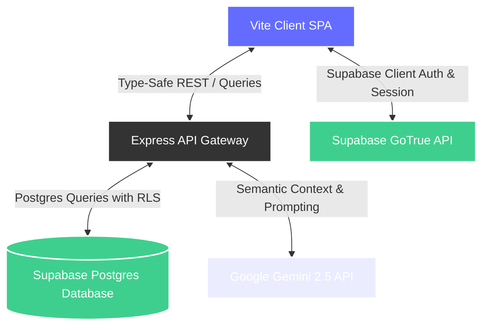

# 🌌 FlowPilot AI — Personal Life Operating System

<div align="center">

[](https://react.dev)
[](https://www.typescriptlang.org)
[](https://vite.dev)
[](https://tailwindcss.com)
[](https://supabase.com)
[](https://ai.google.dev)
[](LICENSE)

**An adaptive, beautiful, and intelligence-driven life co-pilot that coordinates your tasks, habits, plans, and long-term goals into one elegant, glassmorphic dashboard.**

[Explore App](#-architecture-overview) • [Installation](#-installation--setup) • [Deployment](#-deployment-guide) • [Highlights](#-project-highlights)

</div>

---

## 📖 1. Overview & Value Proposition

In today’s fast-paced world, managing tasks, daily habits, calendar events, and long-term goals across multiple fragmented apps leads to cognitive overload and "productivity fatigue." Most planners are static, failing to adapt when life inevitably shifts.

**FlowPilot AI** solves this by introducing a **unified, adaptive Personal Life Operating System**. It acts as your personalized workspace co-pilot:

- **The Unified Timeline**: Coalesces tasks, habits, goals, and breaks into a single, cohesive schedule block.
- **The Adaptive AI Planner**: Driven by Google Gemini, the planner analyzes your constraints, active goals, and working hours settings to automatically draft, prune, and optimize your schedule day-to-day.
- **The High-Performance Workspace**: Immersive HSL tailored dark themes, smooth fluid micro-animations, glassmorphism layers, and zero-flash boots create a gorgeous visual experience that is a joy to interact with.

---

## ✨ 2. Implemented Features

- **🔐 Authentication & User Isolation**: Resilient signup, login, and token session persistence built on Supabase Auth. Complete tenant isolation secures user accounts using Supabase Row Level Security (RLS) policies.
- **📝 Smart Task Triage**: Create, edit, and organize tasks with dynamic tags, due dates, colors, and priority weightings (`low`, `med`, `high`).
- **🌱 Habit Compliance**: Track daily habits with checklist completions. Streaks and consistency ratios are calculated automatically using historical logs over rolling 30-day windows.
- **🎯 Goal Progress Tracking**: Exposes Career, Learning, Health, and Personal category goals with automated progress percentages rendered directly on KPIs.
- **📅 AI Planner with Working Hours**: Set custom daily working boundaries (e.g. `10:00` to `16:00`), preferred focus durations, and break rules. Gemini generates complete plans fitting strictly within these slots.
- **🤖 AI Assistant Workspace Copilot**: Multiturn chat leveraging Gemini 2.5 Flash for proactive briefs, standup reviews, offline-ready fallback templates, and interactive chat confirmation cards to update or delete tasks safely.
- **📊 Analytics KPI Dashboards**: KPI analytics reporting today's success score, AI life balance metrics, habit streaks, 14-day productivity trends, and comprehensive weekly retrospect reviews.
- **🔔 Proactive Notifications Triage**: Automated background scans alert you of backlog build-up, overdue tasks, or broken habits with color-coded low, medium, and high importance flags.
- **🔍 Global Command Palette**: Keyboard-triggered (`Ctrl+K` / `⌘+K`) global search modal. Instantly filters matched tasks, habits, and goals with priority ranking (exact match ➔ starts-with ➔ contains matches) or triggers Quick Navigation links.
- **📅 Synchronized Calendar**: Month-view calendar displaying scheduled tasks and habit completion ticks.
- **⚙️ Tunable Settings**: Live database sync for user timezones, profile names, working hours, and a real-time bidirectional Light/Dark theme toggler.

---

## 🛠️ 3. Tech Stack

### Frontend

- **Core Framework**: React 19, TypeScript 5, Vite 6
- **Routing**: TanStack Router (`@tanstack/react-router`) for type-safe route trees
- **Caching & Queries**: TanStack Query (`@tanstack/react-query`) for local caching and server state updates
- **Styling**: Tailwind CSS v4, Lucide React (for premium typography and icons)
- **Animation**: Framer Motion (for fluid, modern transitions and micro-interactions)

### Backend

- **Environment**: Node.js, Express, TypeScript
- **Security & Logs**: Helmet (secure headers), Winston + Morgan (structured logging pipelines), express-rate-limit

### Infrastructure & Services

- **Database & Auth**: Supabase (Postgres, GoTrue Auth)
- **AI Model**: Google Gemini API (leveraging `gemini-2.5-flash` for high-speed planning and `gemini-2.5-flash-lite` as high-availability fallback)

---

## 🏛️ 4. Architecture Overview

FlowPilot AI follows a robust, decoupling multi-tier architecture to ensure rapid client performance, data consistency, and reliable offline capabilities:



- **Vite SPA (Frontend)**: Runs TanStack Router with type-safety. Manages API requests using TanStack Query.
- **Express Gateway (Backend)**: Aggregates client requests, authenticates headers via Supabase JWTs, builds planning prompts, and interacts with external services.
- **Supabase Service (Data Layer)**: Handles row-level access control, email authentications, and relational schemas.
- **Gemini Service (AI Engine)**: Interprets user calendars, habits, and tasks to synthesize structural JSON schedule timelines.

---

## 🗄️ 5. Database Design

FlowPilot AI relies on a structured, relational PostgreSQL schema. Complete row-level isolation is configured:

| Table Name            | Description                                        | Key Columns                                                                                                                                      |
| :-------------------- | :------------------------------------------------- | :----------------------------------------------------------------------------------------------------------------------------------------------- |
| **`profiles`**        | User metadata, settings, and workspace preferences | `id` (PK, Auth reference), `full_name`, `timezone`, `working_hours_start`, `working_hours_end`, `preferred_deep_work_duration`, `break_duration` |
| **`tasks`**           | Operational items created by the user              | `id` (PK), `user_id` (FK), `title`, `description`, `priority`, `status`, `tag`, `color`, `due_date`                                              |
| **`habits`**          | Daily habits tracked over time                     | `id` (PK), `user_id` (FK), `name`, `color`, `streak`, `habit_consistency`                                                                        |
| **`goals`**           | Long-term outcomes targeted by the user            | `id` (PK), `user_id` (FK), `title`, `description`, `status`, `progress`, `type`                                                                  |
| **`notifications`**   | Alerts scanned and raised dynamically              | `id` (PK), `user_id` (FK), `title`, `message`, `priority`, `read`                                                                                |
| **`schedule_blocks`** | Optimized timeline slots drafted by the AI planner | `id` (PK), `user_id` (FK), `title`, `start_time`, `end_time`, `block_type`, `color`                                                              |
| **`habit_logs`**      | Complete history of habit checks                   | `id` (PK), `habit_id` (FK), `user_id` (FK), `completed_at`                                                                                       |

---

## ⚙️ 6. Environment Variables

### Frontend Setup (`/src` root)

Create a `.env` file at the project root containing:

```env
VITE_SUPABASE_URL=your_supabase_project_url
VITE_SUPABASE_ANON_KEY=your_supabase_anonymous_api_key
VITE_API_URL=http://localhost:8080/api
```

### Backend Setup (`/backend` root)

Create a `.env` file inside the `/backend` folder containing:

```env
NODE_ENV=development
PORT=8080
SUPABASE_URL=your_supabase_project_url
SUPABASE_SERVICE_ROLE_KEY=your_supabase_service_role_key
GEMINI_API_KEY=your_google_gemini_api_key
CLIENT_ORIGIN=http://localhost:5173
```

---

## 🚀 7. Installation & Setup

### Prerequisites

- Node.js (v18+)
- NPM or Bun

### 📦 Step 1: Clone the Repository

```bash
git clone https://github.com/your-username/flowpilot.git
cd flowpilot
```

### 💻 Step 2: Frontend Client Installation

Install the client-side dependencies:

```bash
npm install
```

### 🔌 Step 3: Backend Server Installation

Open a separate terminal window and install server dependencies:

```bash
cd backend
npm install
```

---

## 🏃‍♂️ 8. Running Locally

To start the local sandbox environment, run the frontend and backend servers concurrently:

### 1. Start the Express Backend Server

In the `/backend` folder:

```bash
npm run dev
```

_The backend core engine will boot on port `8080`._

### 2. Start the Vite Frontend Client

In the project root folder:

```bash
npm run dev
```

_The client SPA will boot on port `5173`._

Open your browser and navigate to `http://localhost:5173` to interact with FlowPilot AI.

---

## 📤 9. Deployment Guide

Refer to the complete [Deployment Guide](docs/DEPLOYMENT_GUIDE.md) in the `/docs` directory for deployment blueprints to Vercel, Render, Railway, Docker, and Cloudflare.

---

## 💡 10. Project Highlights & Quality Measures

- **Zero-Flash Dark Theme Persistence**: Incorporates an inline script inside the root document `<head>` parsing theme storage instantly at boot time, preventing ugly "white flashes" on page refreshes.
- **Seamless Seeding Engine**: A robust seeder is bundled. Trigger **Enable Demo Mode** on the settings or dashboard page to populate a complex visual timeline of tasks, habits, and active goals tailored for premium presentation.
- **Offline Resilient Architecture**: The AI Assistant contains offline-ready local commands processing engines ("Start my day", "Show my goals") executing instantly in 40ms without sending a single network packet, safeguarding workflows from LLM limits or network failure.

---

## 📄 11. License

Distributed under the **MIT License**. See `LICENSE` for more information.
